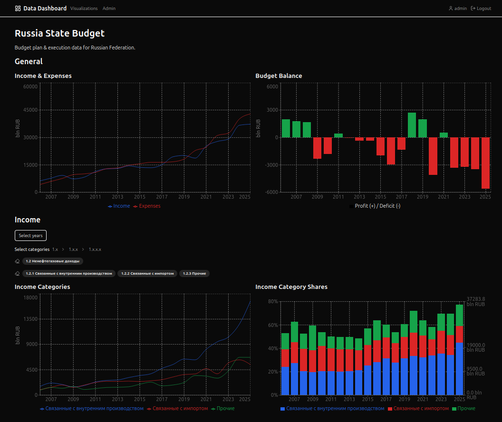

# Data Dashboard
A set of packages for fetching, processing, and visualizing data from various sources.

<div align="center">
    
</div>


## Subprojects
### `data_loading`
ETL jobs orchestrated by Apache Airflow.

**Stack:** Python 3.13, Apache Airflow, httpx, BeautifulSoup, Pydantic


### `dashboard_backend`
REST API for serving visualization data to the frontend, managing frontend users, sessions and visualization settings.

**Stack:** Python 3.13, FastAPI, SQLite, SQLAlchemy, Pydantic, APScheduler


### `dashboard_frontend`
A single-page application with data visualizations and related pages (user profile, admin panel).

**Stack:** TypeScript, React 18, React Router, Redux Toolkit + RTK Query, Zod, Tailwind CSS 4, shadcn/ui, Recharts, MDX


## Development Setup
**Prerequisites**:
- `Python 3.13` and `uv`;
- `Node.js 24`.

```bash
# Create project config from example (edit values if needed)
cp config.env.example config.env

# Python & Node.js dependencies and virtual environment
uv sync --all-packages

nvm use     # or set Node version another way
npm install

# Set up pre-commit hooks
uv run pre-commit install

# Create Airflow metadata database, apply migrations and create an admin user
uv run data_loading/src/airflow/setup.py

# Apply Alembic migrations for backend database
uv run alembic -c dashboard_backend/src/db/migrations/alembic.ini upgrade head
```


## Running in Development
```bash
# Airflow: start API server, scheduler, and DAG processor
# NOTE: new DAGs are disabled by default and must be enabled via Airflow UI
uv run data_loading/src/airflow/local/server.py

# Run dashboard backend
uv run dashboard_backend/src/main.py

# Run dashboard frontend
npm run dev
```


## Running Tests
### Python tests
```bash
# All tests
uv run pytest
## For a specific subproject
uv run pytest data_loading
## A specific test file
uv run pytest data_loading/tests/tests/helpers/test_http_loader.py
```


### Frontend tests
```bash
# All tests
npm test
# Specific test file
npm test dashboard_frontend/tests/tests/components/pages/login.test.tsx
```


### Linting and Type Checking
```bash
# Run all hooks on all files
uv run pre-commit run --all-files

# Python linting only
uv run ruff check

# Python type checking only
uv run mypy

# Frontend linting only
npx eslint

# Frontend type checking only
npx tsc --noEmit
```


## Deploying Locally via Docker Compose
```bash
# Create project config from example (edit values if needed)
cp config.env.example config.env

# Build images and start all services
docker compose --env-file config.env -f deployment/docker_compose/docker-compose.yml up --build -d
```

Airflow UI will be available at `http://localhost:$AIRFLOW_PORT`, frontend - at `http://localhost:$FRONTEND_PORT`.

Note, that new DAGs are disabled by default and must be enabled in order to run.


### Deployment Architecture
**Main containers**:
- `airflow`: API server + scheduler + DAG processor (managed by supervisord);
- `backend`: FastAPI server;
- `frontend`: Nginx serving the built SPA.

**Utility containers**:
- `airflow-init`: one-shot container that initializes the Airflow DB and creates the admin user;
- `backend-init`: one-shot container that applies Alembic DB migrations.

**Volumes**:
- `assets_data`: stores Airflow metadata DB, backend DB, and visualization data.
